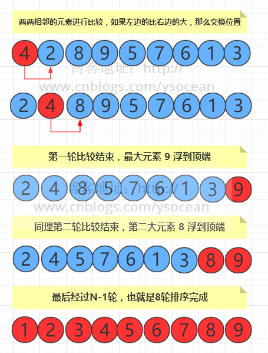

# 冒泡算法解析
## 定义
冒泡排序（Bubble Sort），是一种计算机科学领域的较简单的排序算法。 
通过遍历要排序的数列，依次比较两个元素，按照一定规则排序（比如大小）。当所有的元素按照规则排序成功后，遍历就完成了。
这个算法的名字由来是因为越大（小）的元素会经由交换慢慢“浮”到数列的顶端，故名“冒泡排序”。
## 原理
冒泡排序算法的原理如下：
* 比较相邻的元素。如果第一个比第二个大，就交换他们两个。 
* 对每一对相邻元素做同样的工作，从开始第一对到结尾的最后一对。在这一点，最后的元素应该会是最大的数。 
* 针对所有的元素重复以上的步骤，除了最后一个。 
* 持续每次对越来越少的元素重复上面的步骤，直到没有任何一对数字需要比较  

>图片来源于网络，仅供学习使用

## 算法实现
参看[bubbleSort.js](https://github.com/starsion/study/blob/master/%E7%AE%97%E6%B3%95/%E5%86%92%E6%B3%A1%E6%8E%92%E5%BA%8F/bubbleSort.js)
